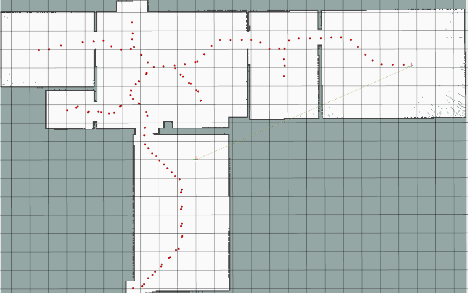

# Robust BIM-based 2D-LiDAR Localization for Lifelong Indoor Navigation in Changing and Dynamic Environments 

Code will be available after publication ~Oct 2022.

Table of Contents
=================

* [Intro](#brief-intro)
* [OGM2PGBM](#Ogm2pgbm)
   * [Principle](#principle)
   * [Usage](#usage)
      * [Args](#args)
      * [Step by step](#step-by-step)
      * [Note](#note-1)
* [GMCL_CARTO](#gmcl_carto)


# Intro
This repo contains package `amcl`, `gmcl`, `cartographer` and `slamtoolbox`, so that you can use and compare their localization performance with a bagfile located in the mounted directory `~/workspace` easily. 

Apart from the open source packages, it includes the following self-developed applications and scripts:

- `OGM2PGBM`: generate sensor data based on a 2D BIM map and publish them to respective topics directly (pgm->bag->pbstream)
- `GMCL_CARTO`: conbine the fast global localization feature of GMCL with the more accurate pose tracking performance of Cartographer


# OGM2PGBM

## Principle

The workflow of OGM2PGBM is as follows, see the function `new_map_callback(self,  grid_map)` for details:

1. **subsribe** map from the map topic
2. **skeletonize** the map and get its voronoi waypoint (see `self.skeletonize()`)
3. perform a **coverage path planning** on it (see `self.CPP()`)
   - extract the farest endpoint pair first as the start and goal point
   - then **dilate** it with a 2x2 kernel to bold the centerline
   - do CPP wavefront algorithm and get the sorted waypoint
4. do a raytracer algorithm on the waypoint one by one, and publish the `/laserscan` topic (see `self.raytracer()`)

It produces `/tf`, `/clock`, `/odom`,  `/scan` topics with frame `robot_map`, `robot_odom` and `robot_base_link`.

As we need to publish `/tf`, we use `python2.7` in this script. 

## Usage
### Args
This package is now a standard ros package and can be launched with roslaunch command.

args:
- `map_file`: default value is `/root/workspace/map/OGM_empty.pgm.yaml`
- `record`: default value is `false`, the recorded bag can be found at `/root/.ros/ogm2pgbm_sensordata.bag`

### Step by step
With the launch file, we only need three steps to generate our base pbstream
1. run into the docker 
```shell
bash autorun.sh
```
2. launch the application with or without the args
```shell
roslaunch ogm2pgbm ogm2pgbm.launch map_file:=/root/workspace/map/OGM_empty.pgm.yaml record:=true 
```
The target bag file will be stored under `/root/.ros/ogm2pgbm_sensordata.bag`. By default, the demo bag will also be copied into this place. So you can also skip the second step if you want.

3. After generating bagfiles, use cartographer to generate pbstream(offline mode, which will generate pbstream quite fast)
```
roslaunch cartographer_ros ogm2pgbm_my_robot.launch bag_filename:=/root/.ros/ogm2pgbm_sensordata.bag
```
You can also launch slam_toolbox. (There will be some error report in the terminal, just ignore them and wait for seconds.)
```shell
roslaunch slam_toolbox ogm2pgbm.launch bag_filename:=/root/.ros/ogm2pgbm_sensordata.bag
```



The target pbstream file will be generated automatically at `/root/.ros/ogm2pgbm_sensordata.bag.pbstream` after . 
For slam_toolbox, you also need to click on the serialization button on the rviz plugin. The target files are also located at `/root/.ros`.

### Note
1. As it is already a package managed by catkin, if you have changed the src code or configuation inside the container, you need to do the following instructions to compile and install the package and source the env.
  ```shell
  $ catkin_make_isolated --install --use-ninja --pkg ogm2pgbm
  $ source install_isolated/setup.bash
  ```
2. All the node will be closed when the rviz is closed, including the rosbag node
3. The parameters of cartographer when using OGM2PGBM scripts to generate pbstream are as follows (see `cartographer_ros/configuration_files/ogm2pgbm_my_robot.lua`)
- `use_pose_extrapolator` and `use_odometry` enabled(The reason is that, we do not have accurate timestamp and speed/imu data, so we'd better provide an accurate odom to do pose extrapolation.)
- remap `/scan` or `/odom` in launch file if needed

# GMCL_CARTO
This project try to combines the pros of the two algorithms.

- First, change the bagname in the line 11 of the file `~/catkin_ws/src/gmcl_carto/gmcl_carto.py`,
- Then, make sure the bagfile is located in the directory `/root/workspace`
- At last, run the script directly `python ~/catkin_ws/src/gmcl_carto/gmcl_carto.py`
